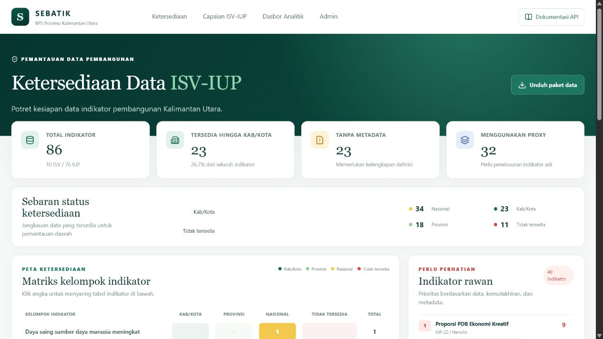
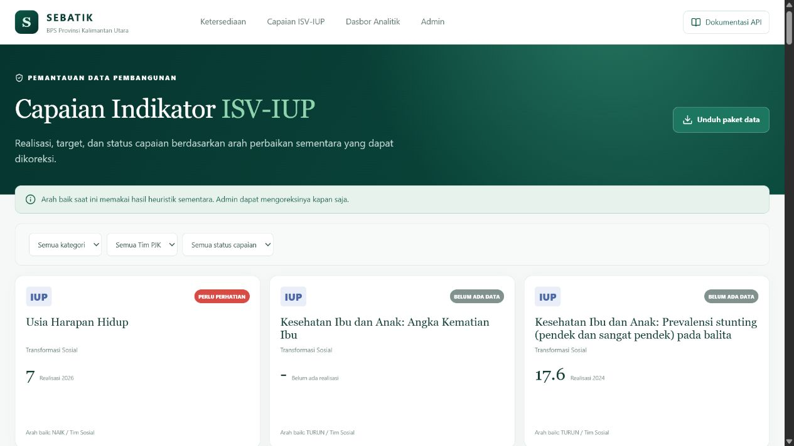
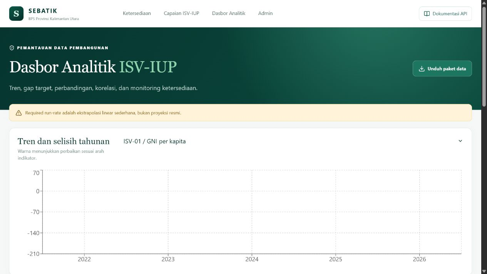
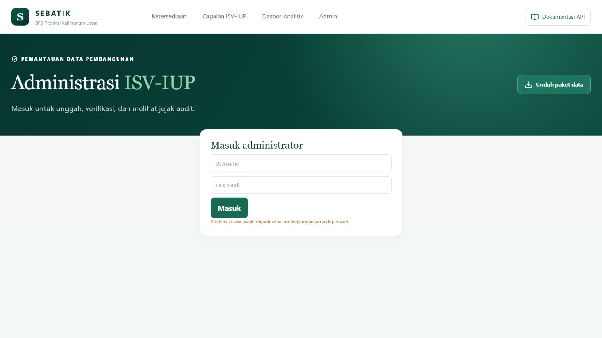

# Panduan Pengguna SEBATIK

## 1. Memantau ketersediaan

Buka menu **Ketersediaan**. Kartu atas menunjukkan jumlah indikator, cakupan kabupaten/kota, metadata yang belum tersedia, dan penggunaan proxy. Klik sel pada matriks untuk menyaring tabel.

## 2. Melihat capaian

Buka **Capaian ISV-IUP**. Gunakan filter kategori, Tim PJK, dan status capaian. Klik kartu untuk membuka grafik realisasi-target, metadata, tata kelola, tabel nilai, serta unduhan indikator.

Status `BELUM ADA DATA` berarti realisasi/target sebanding belum tersedia; sistem tidak menampilkannya sebagai nol persen. Arah NAIK/TURUN masih dapat dikoreksi admin.

## 3. Menggunakan analitik

Buka **Dasbor Analitik**. Pilih indikator untuk melihat selisih tahunan dan gap target. Korelasi hanya ditampilkan jika tersedia sedikitnya empat pasangan tahun. Required run-rate merupakan ekstrapolasi linear sederhana, bukan proyeksi resmi.

## 4. Masuk sebagai admin/PIC

Buka **Admin**, masukkan akun, lalu pilih fungsi yang diperlukan. Kata sandi awal wajib diganti sebelum pemakaian kerja.

## 5. Memperbarui satu nilai

1. Pilih indikator yang menjadi tanggung jawab tim.
2. Isi tahun, jenis, nilai, sumber, dan catatan.
3. Kirim. Nilai berstatus `MENUNGGU_VERIFIKASI` dan belum tampil publik.
4. Penanggung jawab tim memilih `DISETUJUI` atau `DITOLAK`.
5. Nilai yang disetujui masuk ke fakta publik dan tercatat pada audit log.

## 6. Mengunggah Excel baru

1. Admin memilih file `.xlsx`; file lama tidak ditimpa.
2. Sistem memvalidasi lima nama sheet dan menjalankan ETL pada staging.
3. Periksa pratinjau indikator baru/hilang, status berpindah, dan nilai berubah.
4. Pilih **Setujui perubahan** hanya jika pratinjau benar.
5. Sistem menerapkan perubahan, menulis audit log, dan mengambil snapshot ketersediaan.

## 7. Mengunduh data

Tombol **Unduh paket data** menghasilkan ZIP berisi CSV seluruh dataset serta katalog metadata dalam XLSX dan PDF. Halaman detail menyediakan unduhan satu indikator.
